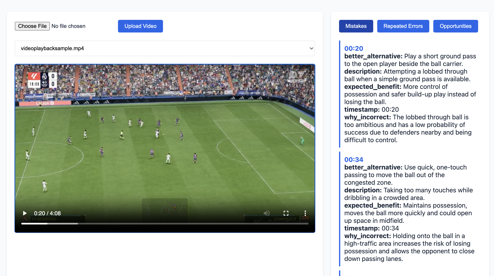

# AI Game Coach - Video Analysis Platform

A Flask-based web application that uses AI to analyze gameplay videos and provide personalized coaching feedback. The application leverages Large Language Models (LLMs) to assess gameplay footage and offer insights similar to a professional gaming coach.

## Features

- Secure video upload and storage
- AI-powered gameplay analysis using Google's Generative AI
- Real-time processing status tracking
- Secure API key management with encryption
- Support for multiple video formats (MP4, AVI, MOV, MKV, WMV, FLV, WEBM)
- File size limits and security measures
- Can be run as a standalone Flask app or in a Jupyter notebook

## Screenshots

### Main Interface


## Running in Jupyter Notebook
`notebooks/run.ipynb`

## Prerequisites

- Python 3.x
- Flask
- Google Generative AI API access
- Cryptography library for API key encryption
- Jupyter Notebook (if running in notebook mode)

## Installation

1. Clone the repository:


2. Install required dependencies:
```bash
pip install flask google-generativeai cryptography werkzeug jupyter
```

3. Set up environment variables:
```bash
export UPLOAD_FOLDER=/path/to/uploads
export ENCRYPTION_KEY=your-encryption-key  # Optional: will auto-generate if not provided
```

## Configuration

The application uses an `AppConfig` class for configuration settings. Key configurations include:

- `UPLOAD_FOLDER`: Directory for storing uploaded videos
- `MAX_CONTENT_LENGTH`: Maximum file size (default: 16MB)
- `ALLOWED_EXTENSIONS`: Supported video formats
- `ENCRYPTION_KEY`: Key for API key encryption

## Usage

### Standalone Flask App
1. Start the Flask server:
```bash
python app.py
```

2. Access the web interface at `http://localhost:5000`

### General Usage Steps
1. Configure your Google Generative AI API key:
   - POST to `/api-key` with your API key
   - The key will be securely encrypted and stored

2. Upload gameplay videos:
   - Use the web interface or POST to `/upload`
   - Supported formats: MP4, AVI, MOV, MKV, WMV, FLV, WEBM
   - Maximum file size: 16MB

3. View analysis results:
   - GET `/videos` for a list of all uploaded videos
   - GET `/analysis/<filename>` for specific video analysis

## API Endpoints

- `POST /api-key`: Configure API key
- `GET /api-key/verify`: Check API key configuration status
- `POST /upload`: Upload video file
- `GET /videos`: List all uploaded videos
- `GET /video/<filename>`: Serve video file
- `GET /analysis/<filename>`: Get analysis results
